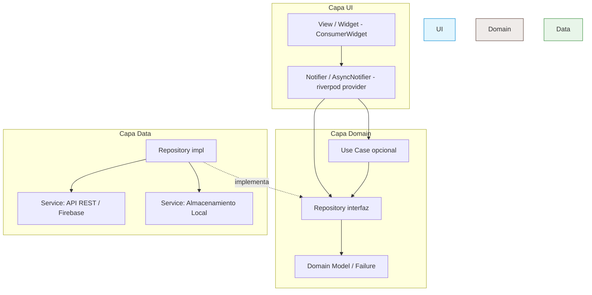

# Arquitectura de la Aplicación

Este documento describe los patrones arquitectónicos, la estructura de directorios y las decisiones técnicas que guían el desarrollo de esta aplicación Flutter. Sigue el esquema de capas y organización de carpetas recomendado por la [guía oficial de arquitectura de Flutter](https://docs.flutter.dev/app-architecture), refinado por la [constitución](../.specify/memory/constitution.md) ratificada del proyecto — **la constitución es la fuente de verdad**; este documento la explica e ilustra. En caso de conflicto, gana la constitución y este archivo debe actualizarse para coincidir con ella.

## 🎯 Objetivos Arquitectónicos
* **Mantenibilidad**: Separación clara de responsabilidades para que el código pueda actualizarse sin efectos secundarios no deseados.
* **Escalabilidad**: Una estructura layer-first que permite compartir repositorios y servicios entre features en vez de duplicarlos.
* **Testabilidad**: Lógica de negocio desacoplada de los widgets de UI, permitiendo pruebas unitarias y de widgets exhaustivas.
* **Consistencia**: Enfoques estandarizados para el manejo de estado, el ruteo y el manejo de datos.

---

## 🏗️ Patrón de Alto Nivel (Riverpod + Capas de Clean Architecture)

El código sigue **Riverpod** como único patrón de manejo de estado para la capa de UI, organizado en tres capas con **dependencias estrictas y unidireccionales** e **inversión de dependencias** en el límite Domain/Data:

* UI depende de Domain (nunca al revés).
* Data **implementa** las interfaces de repositorio de Domain — Domain nunca importa Data.



### 1. Capa UI (Presentation)
* **Views**: Composiciones de widgets que renderizan estado y reenvían eventos del usuario. Se construyen como `ConsumerWidget`/`ConsumerStatefulWidget`, leen el estado vía `ref.watch(xProvider)` y disparan acciones vía `ref.read(xProvider.notifier).algunMetodo()`. Contienen lógica mínima (layout, animación, condicionales simples) — sin lógica de negocio, sin llamadas directas a red/repositorio, sin `setState` para nada que ya sea dueño de un provider.
* **Notifier / AsyncNotifier**: Un provider por feature/pantalla, declarado con `@riverpod` (generación de código). Solo lee la **interfaz de Repository** (y opcionalmente un Use Case) declarada en Domain, convierte el resultado en un `state` inmutable (frecuentemente envuelto en `AsyncValue`), y expone métodos públicos que la View puede llamar directamente — sin necesidad de una clase `Event` separada.

### 2. Capa Domain (siempre presente — no opcional)
A diferencia de un MVVM "delgado", aquí Domain es donde viven los **contratos**, no solo los modelos:

* **Interfaces de Repository** (`abstract class`): el contrato del que depende un Notifier/Use Case. Esto es lo que hace que la capa Data sea intercambiable y mockeable — ver [Inversión de Dependencias](#inversion-de-dependencias-interfaz-de-repository-vs-implementacion) abajo.
* **Domain Models**: clases Dart puras (sin imports de `flutter/material.dart`) — el vocabulario compartido entre Data y UI.
* **Jerarquía de Failure**: una `sealed class Failure` (ej. `ServerFailure`, `CacheFailure`, `NetworkFailure`) que se retorna en vez de lanzar excepciones.
* **Use Cases (opcional)**: solo se agregan cuando la lógica combina datos de **múltiples repositorios** o se reutiliza entre **múltiples Notifiers**. Dependen solo de interfaces de repository, nunca de la capa UI.

> Los Use Cases son opcionales; la **interfaz** del Repository no lo es — todo repositorio tiene una, incluso con una sola implementación.

### 3. Capa Data
* **Implementaciones de Repository**: una clase concreta por cada interfaz de repository de Domain (`class XRepositoryImpl implements XRepository`). Coordina uno o más Services, aplica lógica de cache/retry, captura todas las excepciones y las mapea a un `Failure` antes de retornar — **las excepciones nunca cruzan hacia Domain**. Los repositorios no se conocen entre sí.
* **Services**: envoltorios delgados alrededor de una única fuente de datos externa (API REST, base de datos local, platform channel, `SharedPreferences`, SDK nativo). Sin estado — sin cache, sin lógica de negocio, solo I/O.

### Inversión de dependencias: interfaz de Repository vs. implementación

Domain define el contrato; Data lo implementa. Presentation y Domain solo referencian la interfaz — nunca importan un `*_repository_impl.dart` concreto. Esto significa que:
* Los tests inyectan un fake/mock que implementa la interfaz, sin configurar red ni base de datos.
* Cambiar de backend (REST → Firebase, agregar cache offline-first) solo toca la capa Data.
* Domain permanece estable incluso si se reescribe toda la capa Data.

```dart
// lib/domain/repositories/report_repository.dart
abstract class ReportRepository {
  Future<Either<Failure, List<Report>>> getReports();
}

// lib/data/repositories/report_repository_impl.dart
class ReportRepositoryImpl implements ReportRepository {
  final ReportApiService api;
  ReportRepositoryImpl(this.api);

  @override
  Future<Either<Failure, List<Report>>> getReports() async {
    try {
      final dtos = await api.fetchReports();
      return Right(dtos.map((d) => d.toDomain()).toList());
    } catch (_) {
      return Left(ServerFailure());
    }
  }
}
```

**Solo Repositories y Services tienen interfaz.** Los Notifiers, AsyncNotifiers y Use Cases son la lógica de negocio en sí misma — no hay una implementación alternativa que intercambiar, y ya son testeables inyectando un Repository fake. Darles también una interfaz sería pura ceremonia. El mismo razonamiento aplica a los wrappers de SDKs de terceros (cámara vía `image_picker`, ubicación vía `geolocator`/`geocoding`, mapas, notificaciones push, analytics, almacenamiento local): si la app habla con algo externo y variable, se envuelve detrás de una interfaz — ver el Principio I de la constitución para la lista completa de paquetes aprobados para cada capacidad.

---

## 📁 Estructura de Directorios

Las capas son carpetas de nivel superior (repositorios/servicios se comparten, no se duplican por feature); solo la capa UI se subdivide además por feature.

```text
lib/
├── config/                          # Configuración global de la app
│   ├── routes.dart                  # Configuración de navegación/ruteo (GoRouter)
│   ├── theme.dart                   # Temas claro/oscuro y estilos
│   └── service_locator.dart         # Registros de GetIt (llamado desde main.dart)
├── utils/                           # Helpers y extensiones transversales
│
├── ui/                              # CAPA UI
│   ├── core/                        # Compartido entre todas las features
│   │   ├── ui/                      # Widgets reutilizables (botones, text fields)
│   │   └── themes/
│   ├── auth/                        # Feature de ejemplo
│   │   ├── providers/
│   │   │   └── login_provider.dart  # Notifier/AsyncNotifier con @riverpod
│   │   └── widgets/
│   │       ├── login_screen.dart
│   │       └── login_form.dart
│   └── reports/                     # Feature de ejemplo
│       ├── providers/
│       │   ├── report_list_provider.dart
│       │   └── report_detail_provider.dart
│       └── widgets/
│           ├── report_list_screen.dart
│           └── report_detail_screen.dart
│
├── domain/                          # CAPA DOMAIN
│   ├── models/                      # Domain models puros en Dart + jerarquía de Failure
│   │   ├── user.dart
│   │   ├── report.dart
│   │   └── failure.dart
│   ├── repositories/                # SOLO interfaces — implementadas en data/
│   │   ├── auth_repository.dart
│   │   └── report_repository.dart
│   └── use_cases/                   # Opcional — solo cuando la lógica cruza repositorios/Notifiers
│       └── submit_report_use_case.dart
│
├── data/                            # CAPA DATA — compartida por TODAS las features
│   ├── repositories/                # Implementaciones de domain/repositories/*
│   │   ├── auth_repository_impl.dart
│   │   └── report_repository_impl.dart
│   ├── services/
│   │   ├── api/
│   │   │   └── report_api_service.dart      # Fuente de datos remota vía dio (API REST) o Firebase (Firestore/Storage), según el backend de la feature
│   │   └── local/
│   │       └── report_local_service.dart    # Fuente de datos local (isar/shared_preferences)
│   └── model/                       # DTOs / modelos de request-response (mapeados a domain models)
│       └── report_dto.dart
│
├── app.dart                         # Configuración raíz de Material/Cupertino App
└── main.dart                        # Punto de entrada — llama al setup del service_locator, envuelve app.dart en ProviderScope, y luego corre runApp()
```

**Por qué esta estructura:**
* **Sin repositorios/servicios duplicados por feature.** `data/` es una única capa compartida, así que `AuthRepository`, usado tanto por `auth` como por `reports`, tiene un solo lugar claro donde vivir.
* **Domain models y DTOs nunca se mezclan.** Las formas crudas de API/BD se quedan en `data/model/`; solo los tipos de `domain/models/` cruzan hacia `ui/`.
* **`domain/repositories/` contiene interfaces, `data/repositories/` contiene implementaciones** — este emparejamiento es la expresión concreta de la regla de inversión de dependencias de arriba.
* **`domain/use_cases/` se mantiene opcional**, evitando clases ceremoniales vacías para pantallas CRUD simples.
* **Solo la capa UI es feature-first** (`ui/<feature>/`), ya que las Views/Notifiers son genuinamente específicas de cada feature, mientras que los objetos de Data/Domain son recursos naturalmente compartidos.

---

## 🛠️ Stack Tecnológico y Patrones Principales

### 1. Manejo de Estado
* **Patrón**: `flutter_riverpod` + `riverpod_annotation` (con `riverpod_generator`/`build_runner` en dev dependencies) — el único mecanismo de manejo de estado en la capa UI, usando clases `Notifier`/`AsyncNotifier` con `@riverpod`.
* **Reglas**:
  * Los widgets *nunca* deben contener lógica de negocio ni hacer llamadas directas a red/repositorio.
  * `setState` está prohibido para cualquier estado que ya sea dueño de un provider; solo se permite para estado UI efímero y puramente local (ej. un `AnimationController`) que nunca se expone a un provider.
  * `ref.watch` se usa únicamente dentro de `build()`; para leer un valor una sola vez fuera de `build()` (ej. en un callback) se usa `ref.read`.
  * El estado debe permanecer inmutable. Se usa `freezed` cuando el `state` del provider necesita campos extra de UI más allá del domain model.

### 2. Inyección de Dependencias (DI)
* **Herramienta**: `get_it` (+ `injectable` opcional para generación de código), registrado en `lib/config/service_locator.dart` y llamado una sola vez desde `main.dart` antes de `runApp()`.
* **Reglas**:
  * Repositories y Services: `registerLazySingleton` (una única instancia compartida).
  * El estado de Presentation **no** se registra en GetIt — se expone como un `Provider`/`NotifierProvider` de Riverpod, que resuelve sus propias dependencias internamente (ya sea directamente vía `getIt<T>()` en su constructor, o a través de un provider intermedio `Provider((ref) => getIt<ReportRepository>())`).
  * Los widgets nunca instancian un Notifier o Repository directamente — el estado viene de `ref.watch`/`ref.read`; un Repository/Service usado fuera de un provider viene de `getIt<T>()`.

### 3. Manejo de Errores
* Todo Use Case y todo método de la **interfaz** de Repository en `domain/repositories/` retorna `Future<Either<Failure, T>>` (o `Stream<Either<Failure, T>>`), usando `fpdart`.
* `Failure` es una jerarquía sellada en `domain/models/failure.dart` (`ServerFailure`, `CacheFailure`, `NetworkFailure`, ...).
* Las excepciones se capturan y se mapean a un `Failure` dentro de la **implementación** del Repository — nunca deben propagarse más allá de la capa Data.

### 4. Backend, Red y Parseo de Datos
* **API REST propia o de terceros**: `dio`, para interceptores de request, cache y renovación de tokens.
* **Backend administrado (Firebase)**: `cloud_firestore` para datos estructurados y `firebase_storage` para archivos binarios (ej. fotos), cuando la feature usa Firebase como backend en vez de una API REST propia.
* Ambos clientes pueden coexistir en el proyecto — cuál usa cada Service depende de dónde vive el dato de esa feature, no es una elección global única. Las instancias (`FirebaseFirestore.instance`, `FirebaseStorage.instance`, el cliente `dio`) se registran en GetIt igual que cualquier otro Service (ver sección 2).
* **Serialización**: los DTOs en `data/model/` usan generación de código (`json_serializable` o `freezed`); el mapeo a `domain/models/` ocurre dentro de la implementación del Repository, sin importar si el origen es una API REST o Firebase.

### 5. Ruteo
* **Herramienta**: ruteo declarativo vía `go_router`.
* **Reglas**: la lógica de deep linking y guards de ruta (ej. checks de autenticación) debe centralizarse dentro de `lib/config/routes.dart`.

---

## ⚠️ Reglas Arquitectónicas y Linting

1. **Dependencias solo hacia adentro**: `ui` → `domain` → `data`, nunca al revés. Los archivos en `ui/` nunca deben importar nada de `data/`.
2. **Data Implementa Domain**: todo `data/repositories/*_repository_impl.dart` implementa una interfaz de `domain/repositories/`; Presentation y Domain solo referencian la interfaz.
3. **Los Repositories no se conocen entre sí**: la coordinación entre repositorios pertenece a un Use Case, no dentro de otro Repository.
4. **Domain agnóstico de plataforma**: los archivos dentro de `domain/` no deben importar `package:flutter/material.dart` ni ninguna dependencia de UI.
5. **Los DTOs se quedan en `data/model/`**: solo los tipos de `domain/models/` pueden cruzar hacia `ui/` y `domain/`; los DTOs crudos de API/BD nunca salen de la capa Data.
6. **Sin excepciones más allá de Data**: toda excepción capturada en un Service/Repository debe mapearse a un `Failure`; un `throw` nunca debe cruzar hacia Domain/Presentation. Esto incluye las excepciones propias de Firebase (`FirebaseException` y subtipos) cuando la feature usa Firestore/Storage como backend, y las denegaciones de permiso o errores de `image_picker`, `flutter_image_compress`, `geolocator`, `geocoding` y `permission_handler` (ej. `PermissionFailure`, `LocationFailure`).
7. **`BuildContext` después de `await`**: siempre verificar `context.mounted` inmediatamente antes de usar un `BuildContext` después de un `await`.
8. **Tamaño de archivo**: máximo 200 líneas por archivo de UI (`*_screen.dart`, `*_widget.dart`); extraer sub-widgets al superarlo.
9. **Sin Stateful Widgets para lógica**: un widget usa `ConsumerWidget`/`ConsumerStatefulWidget` únicamente cuando lee un provider (`ref.watch`) o despacha acciones a un Notifier; si no lee ningún provider ni Notifier, es `StatelessWidget`/`StatefulWidget`. `StatefulWidget`/`ConsumerStatefulWidget` se reservan además para asuntos locales y aislados (animaciones, controladores de texto).
10. **Linting obligatorio**: correr estos checks antes de cada commit:
   ```bash
   dart format .
   flutter analyze
   ```

El racional completo y la gobernanza (proceso de enmiendas, política de versionado) viven en la [constitución del proyecto](../.specify/memory/constitution.md).
